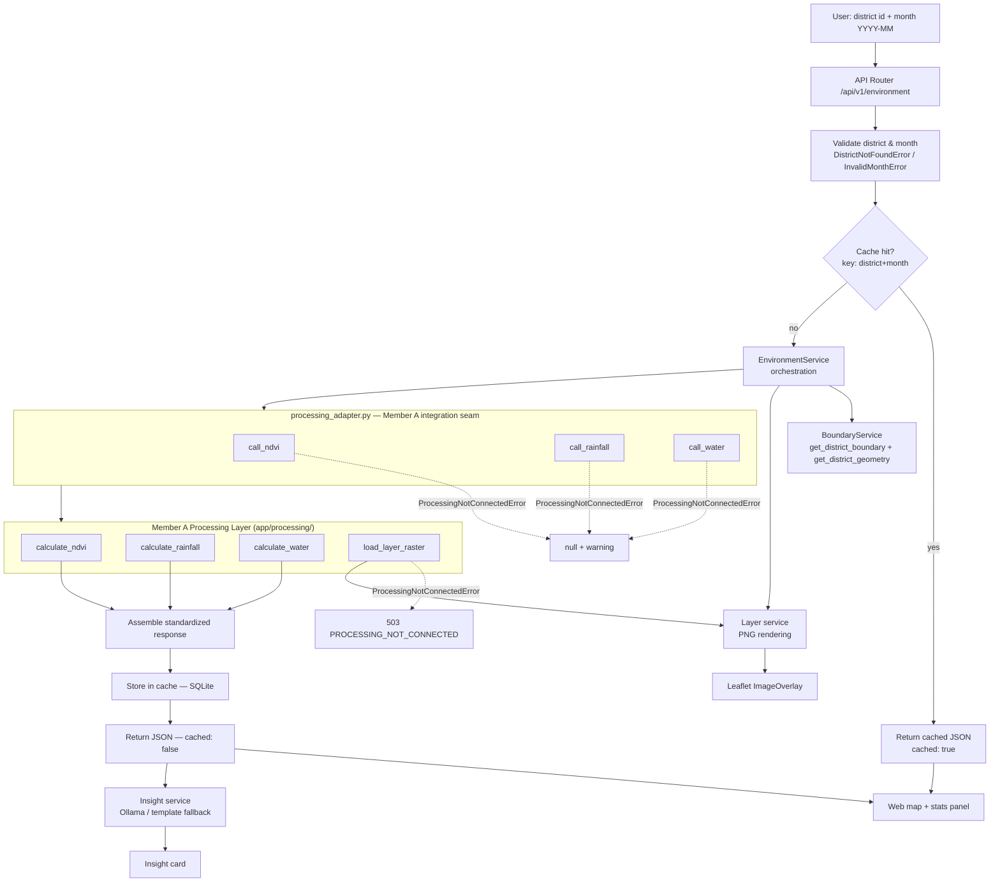

# GeoInsight Architecture

## Data flow



## Team boundary

| Member | Scope | Folder |
|--------|-------|--------|
| **Member A** | Geospatial processing, raster download, NDVI/rainfall/water algorithms | `app/processing/`, `data/` |
| **Member B** | API platform, services, caching, schemas, error handling | `app/main.py`, `app/api/`, `app/services/`, `app/cache/`, `app/models/`, `tests/` |

Member B never writes or modifies raster/geospatial code.  All processing
calls flow through `app/services/processing_adapter.py` → Member A's
functions in `app/processing/__init__.py`.

## Component responsibilities

| Component | Responsibility |
|-----------|----------------|
| `app/main.py` | FastAPI app factory, CORS, global exception handlers, route mounting |
| `app/config.py` | **Single source of truth** for the district registry, data paths and `RAINFALL_METRIC` |
| `app/exceptions.py` | Domain exceptions: `DistrictNotFoundError`, `DataNotFoundError`, `ProcessingNotConnectedError`, etc. |
| `app/models/schemas.py` | Pydantic v2 response contract (stable even with `null` indicators) |
| `app/api/v1/*` | Thin routers: validate input → delegate to service → return JSON. **No raster logic.** |
| `app/services/environment_service.py` | Orchestration: boundary + 3 indicators, partial-failure handling, cache |
| `app/services/processing_adapter.py` | **Single integration seam** between Member B and Member A |
| `app/services/*_service.py` | Per-dataset thin adapters: resolve boundary + paths → call adapter |
| `app/services/layer_service.py` | PNG rendering from arrays returned by Member A (no geospatial calc) |
| `app/processing/` | Member A: NDVI, rainfall, water algorithms, raster I/O |
| `app/cache/cache_manager.py` | SQLite cache keyed by `(district_id, month)` |

## Member A ↔ Member B contract

```
NDVI service  → processing_adapter.call_ndvi(boundary_geom, raster_dir)
                    → app.processing.calculate_ndvi(boundary_geom, raster_dir)

Rainfall svc  → processing_adapter.call_rainfall(boundary_geom, raster_dir)
                    → app.processing.calculate_rainfall(boundary_geom, raster_dir)

Water svc     → processing_adapter.call_water(boundary_geom, raster_dir, area)
                    → app.processing.calculate_water(boundary_geom, raster_dir, area)

Layer service → processing_adapter.load_layer(type, boundary_geom, raster_dir)
                    → app.processing.load_layer_raster(type, boundary_geom, raster_dir)
```

Until Member A wires the functions, the adapter raises
`ProcessingNotConnectedError` and every indicator returns `null` with a
warning — **no values are ever fabricated**.

## Generic district/month handling

- The district registry maps an id → `{display_name, state, boundary_path}`.
- Every service receives `district_id` and `month` as runtime parameters and
  resolves paths through the registry — no district-specific branches.
- Adding a district = one registry entry + boundary + dataset files.

## Missing-data / not-connected behavior

Each indicator is handled independently:

| Situation | `/environment` | `/layers` |
|-----------|----------------|-----------|
| Raster files missing | 200 + `null` + warning `DATA_NOT_FOUND` | 503 `DATA_NOT_FOUND` |
| Processing not connected | 200 + `null` + warning `PROCESSING_NOT_CONNECTED` | 503 `PROCESSING_NOT_CONNECTED` |
| Everything works | 200 with real computed values | 200 with PNG + bounds |

Request-level failures always use standardized errors (404 unknown district,
422 bad month, 422 invalid layer type).

## Deployment env vars

| Variable | Default | Purpose |
|----------|---------|---------|
| `GEOINSIGHT_DATA_DIR` | `./data` | Root data directory |
| `GEOINSIGHT_CACHE_DB` | `{DATA_DIR}/cache.sqlite3` | SQLite cache path |
| `GEOINSIGHT_CORS_ORIGINS` | (see README) | Extra CORS origins |
| `OLLAMA_URL` | `http://127.0.0.1:11434` | Ollama base URL |
| `OLLAMA_MODEL` | `llama3.2:3b` | Insight model |

## Example sequence

```
GET /api/v1/environment?district=kamrup&month=2026-06
  → validate kamrup in registry, month matches ^\d{4}-\d{2}$
  → cache miss
  → load boundary geometry
  → adapter.call_ndvi → ProcessingNotConnectedError → warning
  → adapter.call_rainfall → ProcessingNotConnectedError → warning
  → adapter.call_water → ProcessingNotConnectedError → warning
  → assemble JSON: vegetation=null, rainfall=null, surface_water=null
  → cache under ("kamrup", "2026-06"), return cached:false

GET /api/v1/environment?district=kamrup&month=2026-06
  → cache hit, return cached:true
```
